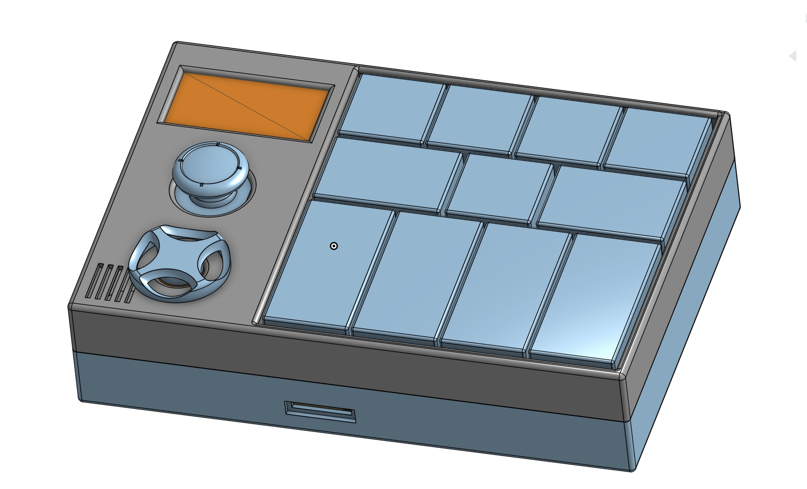

# OpenChord

A portable, open-source music creation device built on the Daisy Seed platform.

<div align="center">
  
  <br><br>
  <a href="https://cad.onshape.com/documents/ba31b49b2d69ae60e3c7e665/w/702c47d3131326b0bcdb3b01/e/0e96b76ad6aba8c5e2682321?renderMode=0&uiState=688ae55320c7c16e74ffb3b5">
    
  </a>
  <br>
  <em>3D enclosure design finalized - Click the button above to explore the full model</em>
</div>

## 🎵 Overview

OpenChord is a modular, portable music creation device that combines the power of the Daisy Seed with a custom hardware design. It features a multi-track recording system, real-time audio processing, and an intuitive interface for music creation on the go.

## 🔥 Use Cases

* 🎹 **Chord Generator**: Use joystick + chord mapping for fast harmonic inspiration
* 🎛️ **Synthesizer**: Design, tweak, and perform complex patches
* 🔁 **Looper**: Capture and layer performance ideas
* 🥁 **Sampler / Drum Machine**: Trigger from built-in pads or MIDI
* 🎚️ **DAW Companion**: Send and receive MIDI, control software instruments
* 🎼 **TRS MIDI Host and Client**: Play with your favorite controller or control your favorite hardware synth

## 📚 Documentation

The complete documentation is available in the [`docs/`](docs/) directory:

- **[Project Overview](docs/overview/project_overview.md)** - Complete project description and features
- **[Firmware Architecture](docs/architecture/firmware_architecture.md)** - Detailed system design
- **[Hardware Documentation](docs/hardware/)** - Pin assignments, connections, and parts list
- **[Development Setup](docs/development/setup.md)** - Environment setup and building

## 🎯 Project Status

This is an active development project. Current progress:

### Project Structure & Planning
- ✅ **Project structure and planning docs** (99% complete)
- ✅ **Basic firmware architecture** (95% complete)
- ✅ **Hardware pinout planning** (98% complete)
- ✅ **Official parts list generation** (95% complete)

### Hardware Design
- ✅ **3D printed enclosure design** (100% complete)
- ✅ **Hardware layout and circuit planning** (100% complete)

### Firmware Development
- ✅ **IO system implementation** (80% complete)
- ✅ **Audio processing system** (60% complete)
- ⏳ Display and UI system (0% complete)
- ⏳ Plugin system implementation (0% complete)

### Progress Overview
```
Project Structure & Planning: █████████░ 95%
Hardware Design:            ██████████ 100%
Firmware Development:       ███░░░░░░░ 30%
Overall Project:            ████░░░░░░ 40%
```

## 🤝 Contributing

We welcome contributions! Please see our [Development Setup Guide](docs/development/setup.md) for getting started, and feel free to open issues or submit pull requests.

## 📄 License

This project is licensed under the MIT License - see the [LICENSE](LICENSE) file for details.

## 🔗 Links

- [Daisy Seed Documentation](https://daisy.audio/)
- [libDaisy GitHub](https://github.com/electro-smith/libDaisy)
- [DaisySP GitHub](https://github.com/electro-smith/DaisySP) 