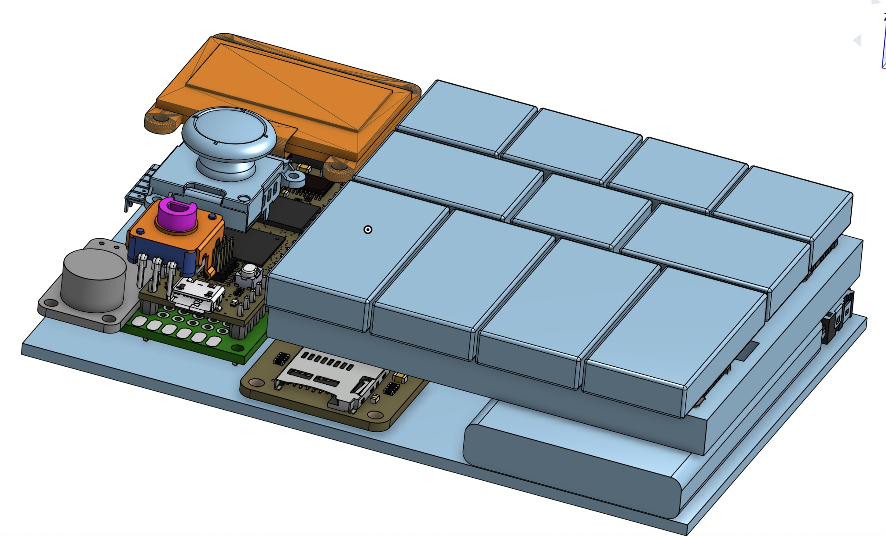

# OpenChord Documentation

Welcome to the OpenChord documentation! This project is a portable, open-source music creation device built on the Daisy Seed platform.

## 🎨 3D Enclosure Design (WIP)

  
    
  
   
  <em>3D enclosure design in progress - Click the button above to explore the full model</em>

## 📚 Documentation Structure

### Overview
- **[Project Overview](overview/project_overview.md)** - Complete project description, use cases, features, and more

### Architecture
- **[Firmware Architecture](architecture/firmware_architecture.md)** - Detailed firmware design, track structure, scenes, and plugin system

### Hardware
- **[Pinout Documentation](hardware/pinout.md)** - Detailed pin assignments and hardware connections
- **[Parts List](hardware/partsList.md)** - Complete component list with pricing and purchase links

### Development
- **[Development Setup](development/setup.md)** - How to set up your development environment and build the project

## 🎯 Project Goals

- **Portable music creation** - Take your studio anywhere
- **Modular firmware** - Easy to extend and customize
- **Open source** - Community-driven development
- **High-quality audio** - Professional-grade sound processing
- **Intuitive interface** - Consistent, responsive UI

## 📖 Additional Resources

- [Daisy Seed Documentation](https://daisy.audio/)
- [libDaisy GitHub](https://github.com/electro-smith/libDaisy)
- [DaisySP GitHub](https://github.com/electro-smith/DaisySP) 